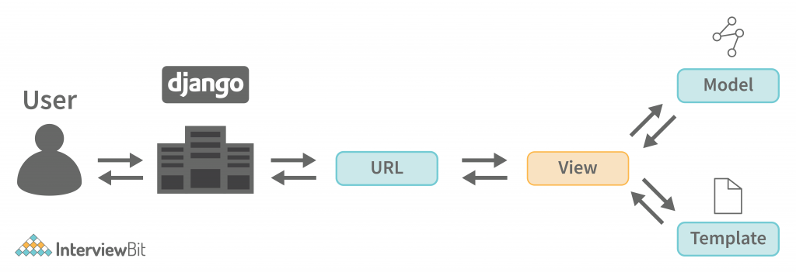

# Pertanyaan dan Jawaban Tugas 2

## Jelaskan bagaimana cara kamu mengimplementasikan checklist di atas secara step-by-step (bukan hanya sekadar mengikuti tutorial).

Untuk step by stepnya tentu saya lakukan seperti yang ada di tutorial sebelumnya karena itu yang diajarkan namun karena ini ada tugas yang berbeda tentu saja ada konfigurasi yang berbeda. Pertama tentu saja kita siapkan proyek django kita lalu setelah itu kita buat folder mainnya nah lalu atur routingnya agar proyek dapat menjalankan main. Sejauh ini masih sama saja namun perbedaan terletak pada .env.prod yang mana untuk tugas ini menggunakan schema tugas_individu selanjutnya untuk settings.py masih sama juga langkah-langkahnya sama juga mungkin hal seperti ALLOWED_HOST yang disesuaikan sesuai pws untuk proyek ini. Oh ya untuk model product sebelumnya karena requirementnya hanya perlu membuat "model product mentahnya dulu" jadi definitionnya saja. selanjutnya seperti biasa kalau models diubah kita lakukan migrations agar table di databasenya berubah. Dan terakhir kita membuat file template home.html yang mana fungsi home(request) di views.py yang kita buat sebelumnya mengembalikan konteks yang dibuat yaitu disini nama app, nama, npm dan kelas. Lalu selesai deh untuk tugas tahap ini dan sudah bisa di push ke pws (jgn lupa untuk konfigurasikan dlu enviroment di pwsnya dan allowedhost di settings.py yang dibilang tdi)

## Buatlah bagan yang berisi request client ke web aplikasi berbasis Django beserta responnya dan jelaskan pada bagan tersebut kaitan antara urls.py, views.py, models.py, dan berkas html.

Berikut bagan alur sederhana django  
sumber bagan : https://www.interviewbit.com/blog/django-architecture/

**Penjelasan keterkaitan:**

- **User** : User akan mengirimkan request
- **urls.py**: Menerima request dari client, lalu menentukan fungsi (view) mana yang harus dijalankan berdasarkan URL yang diakses. (Di cocokin dulu)
- **views.py**: Berisi fungsi yang akan dijalankan. Di sini, data bisa diolah, diambil dari database lewat models.py, lalu dikirimkan ke template HTML
- **models.py**: Berisi definisi struktur data/database. View akan mengambil atau menyimpan data ke database melalui model ini
- **Template HTML**: Berkas HTML yang akan dirender oleh view, berisi data yang sudah diolah, lalu dikirim sebagai response ke client

Jadi, ketika client mengakses suatu URL, request akan diarahkan oleh urls.py ke views.py. Jika perlu data, views.py akan mengambilnya dari models.py. Setelah data siap, views.py akan merender template HTML dan mengirimkannya kembali ke client sebagai response

Ringkasan alur : User akses URL -> Urls.py ngarahin request ke fungsi di views.py -> views.py olah logika danambil data dari model.py -> data dikirim ke Template -> template render jadi html -> response balik ke browser si user

## Jelaskan peran settings.py dalam proyek Django!

Di dalam proyek Django settings.py berperan sebagai tempat utama konfigurasi dari proyeknya. Semua pengaturan utama ditaruh di sini. Ada seperti bagian yang mengatur DATABASE lokasi file statis (STATIC_URL), daftar aplikasi terpasang (INTALLED_APPS), pengaturan keamanan seperti SECRET_KEY dan ALLOWED_HOSTS, bahsa dan waktu seperti TIME_ZONE dan LANGUANGE_CODE dan konfigurasi lainnya. Ya singkatnya setiap perubahan pada pengaturan proyek dilakukan melalui settings.py ini

## Bagaimana cara kerja migrasi database di Django?

Nah ketika kita membuat atau mengubah model yang ada di models.py, Django tidak akan langsung mengubah struktur table yang ada di dalam database, namun bakal mencatat terlebih dahulu perubahan itu di dalam sebuah file "migrasi" yang ada di folder migrations. File migrasi ini berisi instruksi yang bakal diterjemahkan menjadi perintah sql untuk memodifikasi struktur database kita.

python manage.py makemigrations akan menghasilkan file migrasi berdasarkan perubahan model

python manage.py migrate akan mengeksekusi instruksi yang ada di file yang sudah dibuat tadi ke dalam database sehingga perubahan di dalam model bakal tercermin di database.

## Menurut Anda, dari semua framework yang ada, mengapa framework Django dijadikan permulaan pembelajaran pengembangan perangkat lunak?

Kalau menurut saya sendiri khususnya di fasilkom kita mempelajari django terlebih dahulu karena django adalah framework dari python dan di fasilkom ui kita sudah mempelajari python saat ddp 1 dan mengingat pbp matkul prasyaratnya hanya ddp 1 saja. Selain itu, bahasa python sendiri lebih ramah pemula. Django sendiri sudah include hal seperti ORM,auth, template engine,dll. Dengan django sendiri kita bisa langsung belajar konsep fundamental web app: model, view, database, API tanpa harus berurusan dulu dengan banyak kombinasi build tools dan framework lain yang biasanya harus digunakan bersamaan jika ingin membangun web fullstack lengkap.

## Apakah ada feedback untuk asisten dosen tutorial 1 yang telah kamu kerjakan sebelumnya?

Jujur tidak ada sih karena lancar-lancaer saja tutorial 1 kemarin
