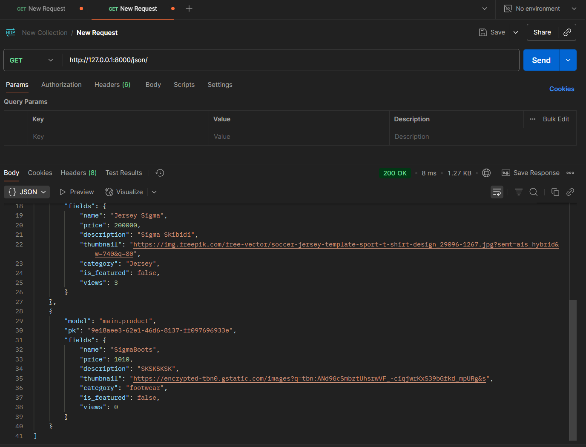
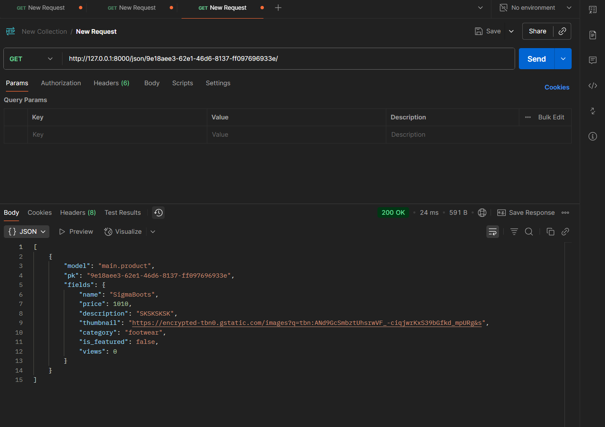
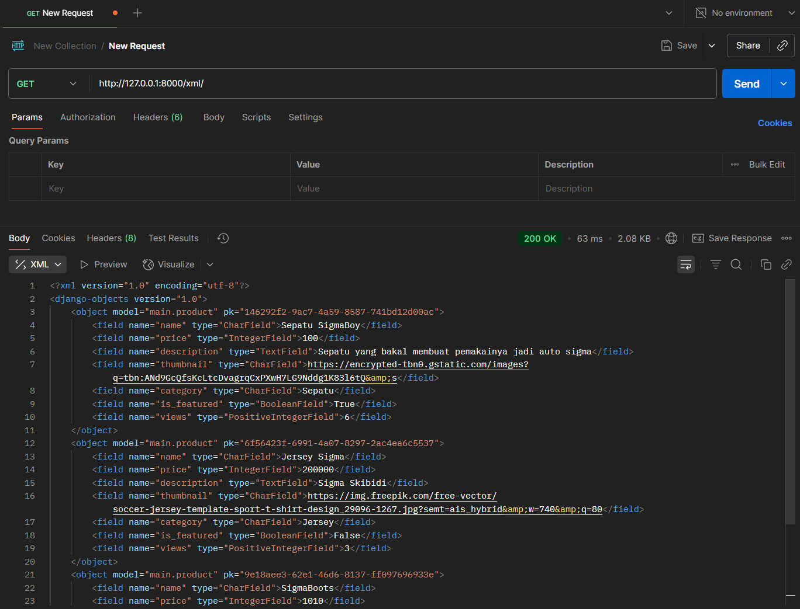
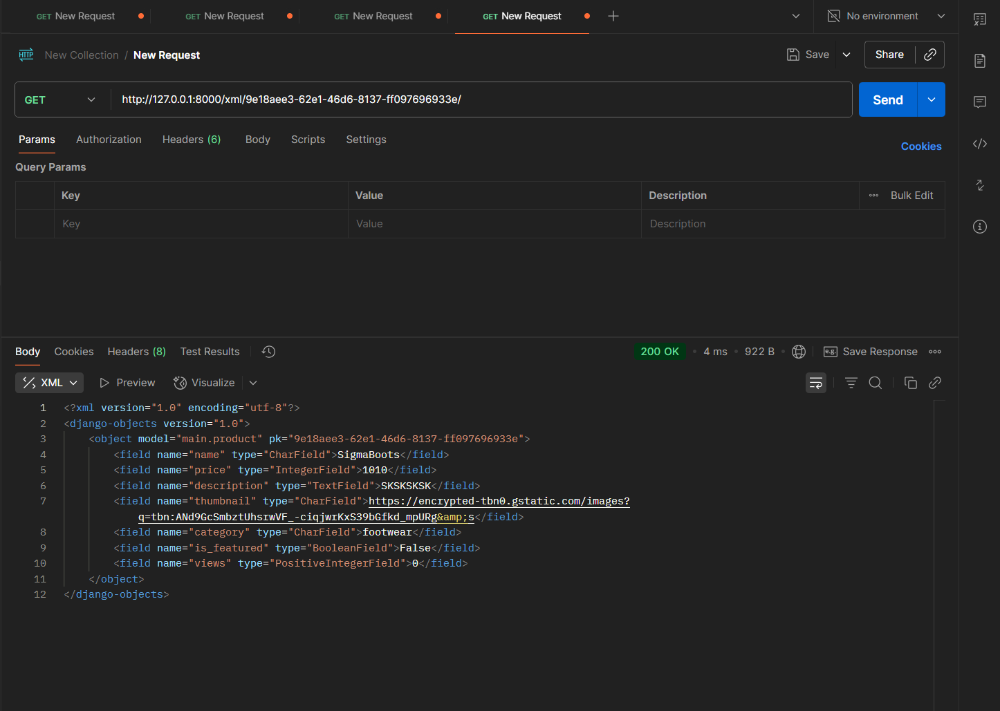

## Jelaskan mengapa kita memerlukan data delivery dalam pengimplementasian sebuah platform?

Data delivery ini bisa dibilang adalah bagaimana data dipindahkan dari satu tempat ke tempat lain misalnya dari server ke client

Alasan mengapa data delivery ini penting ialah ia menjamin ketersediaan data, memastikan tiap komponen (be,fe,api,dll) dapat berkomunikasi secara tepat, menjaga konsistensi dan akurasi data

Data delivery biasanya juga mencangkup retry, acknowledgement dan fault tolerance. ini penting agar data tidak hilang meskipun server down selain itu data delivery yang baik juga sering dilengkapi sistem keamanan seperti enkripsi dan authentication agar data aman sata berpindah. Data delivery yang baik juga membuat sistem lebih cepat dan scalable dikarenakan data delivery memungkinkan platform mendistribusikan data ke berbagai lokasi atau server yang terpisah secara geografis (lupa namanya pernah liat di yt)

## Menurutmu, mana yang lebih baik antara XML dan JSON? Mengapa JSON lebih populer dibandingkan XML?

Kalau dari saya sendiri sih lebih baik JSON. Hal ini dikarenaka Json sendiri syntaksnya lebih enak untuk dibaca (lebih readable lah) dan lebih ringkas. Sehingga ya gampang aja gitu kalau mw fixing

kalau alasan mengapa lebih populer sih sepertinya sama seperti jawaban saya yang diatas ditambah katanya json ini lebih compact dan lebih flexible dibanding xml.

## Jelaskan fungsi dari method is_valid() pada form Django dan mengapa kita membutuhkan method tersebut?

Method is_valid() ini berfugsi sebagai validasi untuk mencegah data yang tidak valid yang mw kita post/masukin ke databse atau bisa juga mencegah cross site scripting(xss). Selain itu is_valid juga bisa menyediakan pesan error.

## Mengapa kita membutuhkan csrf_token saat membuat form di Django? Apa yang dapat terjadi jika kita tidak menambahkan csrf_token pada form Django? Bagaimana hal tersebut dapat dimanfaatkan oleh penyerang?

CSRF token ini dibutuhkan untuk mencegah request palsu, mastiin kalau form ini benar benar dikirim dari web/app kita. saat user ngirim form, django bakal ngecek nih apakah token yang dikirim sama dengan token yang disimpan dalam session dan jika cocok requestnya di sah dan jika tidak ya ditolak. CSRF ini bisa dibilang nambahin keamanan dari app/web yang kita buat ini.

Jika tidak ada CSRF_token, Web/app bakal rentan terhadap serangan CSRF dimana attacker ini ngemanfaatin cookies.

(misalnya broswer korban nympan cookies dari web pentinglah trus si korbannya ini gak sengaja ngeakses web berbahaya lain yang mana di browser yang sudah ada cookiesnya ini nah si web jahatynya ini bakal ngirim request bersamaan sama cookie sessionnya ni ke web yang si korban punya cookiesnya, dan si webnya ini mengira request+cookie sessionya itu benar benar punyanya si pemilik akun)

## Jelaskan bagaimana cara kamu mengimplementasikan checklist di atas secara step-by-step (bukan hanya sekadar mengikuti tutorial).

Disini Alurnya sendiri kurang lebih ya sama aja sama tutorial namun seperti biasa ya disesuaikan juga sama projectnya. Fokusnya sama yaitu data delivery dan form. Modelsnya disini berbeda disesuaikan sama kebutuhan saya juga walaupun kurleb ya sama juga sih. Karena models tadi yang berbeda jadi pembuatan untuk formsnya perlu disesuaikan sedikit. Di setting juga sama ditambahin CSRF tokens (Disesuaikan juga). Untuk views.py juga ada method untuk create(post) ama show(get) yang ya disesuaikan juga. Disni juga saya coba ngebuat ui-nya pakai tailwind via cdn.  
(Ref: https://medium.com/@sauddsaleem/seamless-integration-of-tailwind-css-using-cdn-with-django-a-step-by-step-guide-ba5f3933b55d )

## Apakah ada feedback untuk asdos di tutorial 2 yang sudah kalian kerjakan?

Tidak ada aman aman saja

## screenshot dari hasil akses URL pada Postman

Get JSON

Get JSON by ID

Get XML

Get XML by ID

