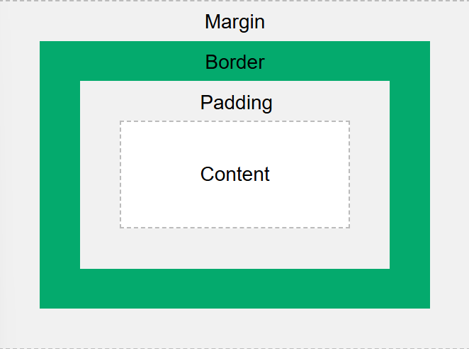

## Jika terdapat beberapa CSS selector untuk suatu elemen HTML, jelaskan urutan prioritas pengambilan CSS selector tersebut!

Prioritas pengambilan menurut css specificity hierarcy

1. Inline styles, dimana jika kita menulis CSS langsung di atribut style dalam elemen HTML, maka akan diprioritaskan paling tinggi
2. Id selectors ini punya bobot yang lebih kuat dibanding class atau tag karena bisa unik dalam satu halaman
3. Classes, attribute selectors and pseudo-classes ini di tengah tengah lebih kuat dari tag tapi lebih lemah dari ID
4. Elements (seperti p, div atau h1) and pseudo-elements (::before atau ::after) jadi kalau ada aturan lain lebih spesifik aturan berbasis tag ini bakal kalah
5. Universal selector (\*) and :where() ini terakhir karena dianggap tidak punya bobot (specifity=0)

ref : https://www.w3schools.com/css/css_specificity.asp

## Mengapa responsive design menjadi konsep yang penting dalam pengembangan aplikasi web? Berikan contoh aplikasi yang sudah dan belum menerapkan responsive design, serta jelaskan mengapa!

Kalau menurutku karena user yang mengaksesnya kan pasti akan dari berbagai macam device nah hal ini memudahkan usernya biar enak gitu dan juga responsive design ini ningkatin kenyamanan user ka (misal teks mudah dibaca tanpa harus zoom, tombol cukup besar buat diteken, dll) elemen-elemennya itu tersusun rapi sesuai device yang diapakai, biar user experiencenya itu bagus dan lancar.

Untuk contohnya bisa dilihat di [Website ini](https://dequeuniversity.com/library/responsive/1-non-responsive?)
Nah website yang disedianin oleh deque university ini nunjukkin design wesbite yang tidak responsive design karena beberapa hal seperti layout tetap dan gambarnya tidak fleksibel

## Jelaskan perbedaan antara margin, border, dan padding, serta cara untuk mengimplementasikan ketiga hal tersebut!

Margin ini ruang kosong di luar elemen (antara elemen tsb dengan elemen lain disekitar) Fungsinya buat memberi jarak antar elemen agar tidak terlalu rapat

Border ini garis pembatas di sekeliling elemen diantara margin dan padding, fungsinya buat bungkus isi elemen

padding ini ruang kosong di dalam elemen antara konten dengan border. fungsinya membei ruang agar konten tidak nempel langsung pada border

Berikut contoh kode CSS untuk membuat sebuah box yang menerapkan margin, border, dan padding:

```css
div {
  width: 300px;
  border: 15px solid green;
  padding: 50px;
  margin: 20px;
}
```

Dan hasilnya akan tampak seperti sebuah kotak dengan:

- **Margin**: ruang di luar kotak, memisahkan kotak dari elemen lain.
- **Border**: garis hijau tebal di sekeliling kotak.
- **Padding**: ruang di dalam kotak antara border dan isi konten.

Ilustrasi :



ref : https://www.w3schools.com/Css/css_boxmodel.asp

## Jelaskan konsep flex box dan grid layout beserta kegunaannya!

Flexbox merupakan metode tata letak css digunakan untuk mengatur elemen dalam 1 dimensi, yaitu baris atau kolom. dimana dgn flexbox, elemen-elemen di dalam sebuah kontainer bisa otomatis menyesuaikan ukuran dan posisi ruang tersedia.

Grid layout merupakan metode tata letak css 2 dimensi yaitu baris dan kolom sekaligus. Dengan grid ini memungkinkan kita buat nyusun elemen seperti tabel tanpa perlu float atau position.

singkatnya Grid digunain biasanya buat layout besar yang libatin baris dan kolom (2D) kalau flexbox buat susunan linear dalam satu dimesi (1D)

ref : https://www.geeksforgeeks.org/css/comparison-between-css-grid-css-flexbox/

## Jelaskan bagaimana cara kamu mengimplementasikan checklist di atas secara step-by-step (bukan hanya sekadar mengikuti tutorial)!

Untuk edit dan delete sendiri saya mengikuti dari yang tutorial namun tentu saya sesuaikan dikit dan untuk styling websitenya sendiri saya hanya memodif yang sudah saya buat sebelumnya untuk mengakomodasikan beberapa perubahan yang saya inginkan
